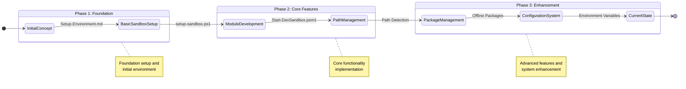

# Development History

## Project Evolution

This document tracks the evolution of the Windows Sandbox Development Environment project, from initial concept to current implementation.

## Initial Requirements

Started with the need to create a sandboxed testing environment that would:
1. Replicate the user's PowerShell environment (`D:\OneDrive\Documents\PowerShell`)
2. Provide isolated testing capabilities
3. Support offline package management

## Development Journey



```
timeline
    title Development Journey

    section Phase 1: Foundation
        Initial Concept : Setup-Environment.md
        Basic Sandbox Setup : setup-sandbox.ps1
        Module Development : Initial structure

    section Phase 2: Core Features
        Module Development : Start-DevSandbox.psm1
        Path Management : Path Detection
        Package Management : Basic functionality

    section Phase 3: Enhancement
        Package Management : Offline Packages
        Configuration System : Environment Variables
        Current State : Final implementation
```

## Development Phases

### Phase 1: Foundation
1. Initial concept development
   - Location: `C:\Users\Charles\.pwsh\Setup-Environment.md`
   - Purpose: Define sandbox testing environment requirements
   - Key Focus: Environment replication strategy

2. Basic sandbox setup
   - Location: `C:\Users\Charles\.pwsh\sandbox`
   - Key Files: `setup-sandbox.ps1`
   - Implementation: Basic Windows Sandbox configuration

### Phase 2: Core Features
1. Module Development
   - Created `Start-DevSandbox.psm1`
   - Implemented core cmdlet functionality
   - Added installation options

2. Path Management
   - Enhanced path detection
   - Added OneDrive integration
   - Implemented version-aware paths

### Phase 3: Enhancement
1. Package Management
   - Location: `D:\Env\packages`
   - Purpose: Offline package repository
   - Implementation: Structured package management

2. Configuration System
   - Added environment variables
   - Implemented flexible paths
   - Enhanced installation options

## Key Components

### Sandbox Setup
- Location: `C:\Users\Charles\.pwsh\sandbox`
- Purpose: Core sandbox environment
- Key Files:
  - `Start-DevSandbox.psm1`
  - `setup-sandbox.ps1`
  - `setup-manifest.json`

### Package Management
- Location: `D:\Env\packages`
- Purpose: Offline package repository
- Structure:
  - `vscode/`
  - `powershell/`
  - `git/`

## Environment Variables Evolution

1. Initial Setup
   - Basic path configuration
   - Simple installation options

2. Enhanced Configuration
   - `PWSH_ONEDRIVE_PATH`
   - `PWSH_DEV_PATH`
   - `PWSH_PROJECT_ROOT`
   - `PWSH_SETUP_SCRIPT`

## Current State

The project has evolved into a robust PowerShell module that provides:
1. Isolated development environments
2. Flexible installation options
3. Comprehensive offline package management
4. Version-aware path handling
5. Enhanced configuration capabilities

## Future Directions

1. Cross-platform support investigation
2. Enhanced package management
3. Automated update system
4. Expanded testing capabilities
